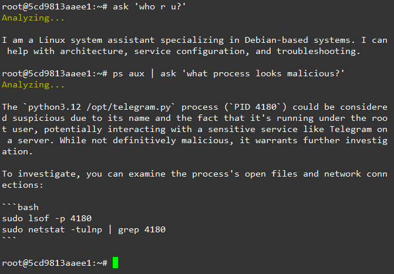

# 🐧 ask - The AI Linux Troubleshooting CLI

`ask` is a lightweight, AI-powered Bash script designed for Linux systems. It integrates the OpenRouter API directly into your terminal to act as an expert Linux assistant.

## ✨ Features

* **Native Terminal Integration**: Works directly in your CLI.
* **Log Analysis via Pipe**: Easily pipe `tail`, `cat`, `journalctl`, or `grep` outputs directly into the AI.
* **Safe JSON Parsing**: Uses `jq` to safely handle special characters in your logs without breaking the API request.
* **Laser-Focused**: Refuses non-Linux questions to keep the context strictly on server administration.

---

## 🛠️ Prerequisites

This script requires two standard command-line tools to function:

1. **`curl`**: To send HTTP requests to the OpenRouter API.
2. **`jq`**: To safely build and parse JSON payloads.

**Installation (Debian/Ubuntu):**

```bash
sudo apt update && sudo apt install curl jq -y

```

---

## 🔑 How to Get an OpenRouter API Key

OpenRouter acts as a unified interface for various AI models (like OpenAI, Anthropic, Meta, etc.). By default, this script uses the `openrouter/auto` routing, which automatically selects the best/most cost-effective model.

1. Go to [OpenRouter.ai](https://openrouter.ai/) and sign up or log in.
2. Click on the **"Keys"** tab in the dashboard (or go directly to [openrouter.ai/keys](https://openrouter.ai/keys)).
3. Click **"Create Key"**.
4. Give your key a name (e.g., "Linux CLI Ask").
5. **Copy the generated API Key.** (It will start with `sk-...`). *Note: Keep this key secret!*

---

## 🚀 Installation & Setup

1. **Create the script file** in your local binary directory so it can be run from anywhere:
```bash
sudo nano /usr/local/bin/ask

```

2. **Paste the Bash code** into the file.
3. **Insert your API Key** directly into the script. Find line 4 and replace the placeholder:
```bash
API_KEY="sk-..."

```


4. **Save and exit** the text editor (in Nano, press `Ctrl+O`, `Enter`, then `Ctrl+X`).
5. **Make the script executable**:
```bash
sudo chmod +x /usr/local/bin/ask

```

---

## 💻 Usage Guide

You can use `ask` in two primary ways: asking direct questions or piping log outputs.

### 1. Direct Questions

Just pass your query as an argument enclosed in quotes.

```bash
ask "how do I configure a reverse proxy for a node app in nginx?"
ask "what is the difference between systemctl reload and restart?"
ask "how to properly harden SSH on Debian 12?"

```

### 2. Piped Log Analysis (Troubleshooting)

Pipe the output of any command directly into `ask`. You can optionally add an instruction at the end.

**Analyze an error log with specific instructions:**

```bash
tail -n 20 /var/log/apache2/error.log | ask "find the specific error causing the 500 status and give me the fix"

```

**Auto-analyze a service failure:**
*(If you don't provide a question, the script defaults to asking the AI to explain the output and provide solutions).*

```bash
journalctl -xeu sshd | ask

```

**Investigate port conflicts:**

```bash
sudo ss -tulnp | grep 4180 | ask "what service is this and how do I safely kill it?"

```



> Vibe coded with Gemini
